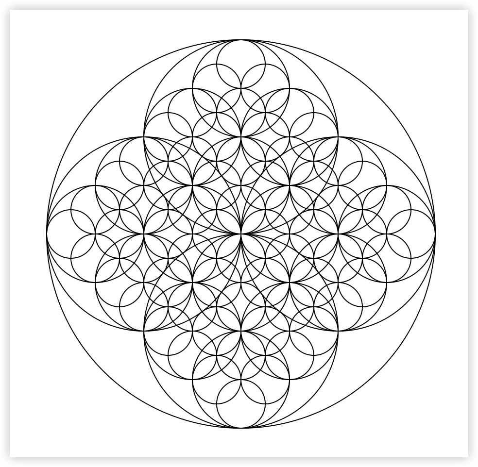

# Charming

<a href="https://observablehq.com/d/18b3d6f3affff5bb"></a>

Charming is a JavaScript library for data-driven generative art that allows artists, designers, educators, and engineers to create expressive, accessible SVG graphics.

Charming’s API is inspired by data visualization grammar — systems like [AntV G2](https://g2.antv.antgroup.com/), [Observable Plot](https://observablehq.com/plot/) and [Vega-Lite](https://vega.github.io/vega-lite/) — where visuals are built from meaningful, composable units. By combining declarative structure with the power of SVG, Charming encourages a more thoughtful, expressive, inspectable and accessible approach to generative art.



```js
import * as cm from "charmingjs";

function circles(x, y, r, data = []) {
  if (r < 16) return;
  data.push({x, y, r, depth});
  circles(x - r / 2, y, r * 0.5, data);
  circles(x + r / 2, y, r * 0.5, data);
  circles(x, y - r / 2, r * 0.5, data);
  circles(x, y + r / 2, r * 0.5, data);
  return data;
}

const svg = cm.render({
  width: 480,
  height: 480,
  marks: [
    cm.svg("circle", circles(240, 240, 200), {
      cx: (d) => d.x,
      cy: (d) => d.y,
      r: (d) => d.r,
      stroke: "black",
      fill: "transparent",
    }),
  ],
});

document.body.appendChild(svg);
```

## Resources 📚

- Documentation - https://charmingjs.org/
- Features - https://charmingjs.org/what-is-charming
- Examples - https://observablehq.com/d/18b3d6f3affff5bb

## License 📄

MIT@Bairui SU
