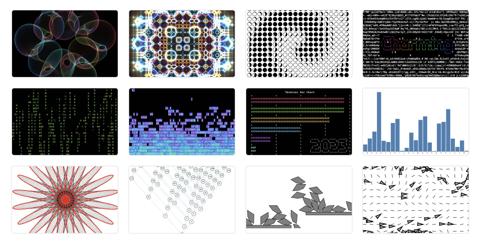

# Charming

Charming is a free, open-source, lightweight JavaScript library for generative art and data visualization. It offers a focused set of APIs for manipulating with SVG, Canvas and HTML in a data-driven style, and is designed to integrate seamlessly with other libraries such as [D3](https://d3js.org/) and [p5](https://p5js.org/).

## Demos 🎨

https://pretext.charmingjs.org/

## Documentation 📚

https://charmingjs.org/

## Examples 📊

https://observablehq.com/d/18b3d6f3affff5bb

## License 📄

MIT @ Bairui SU
